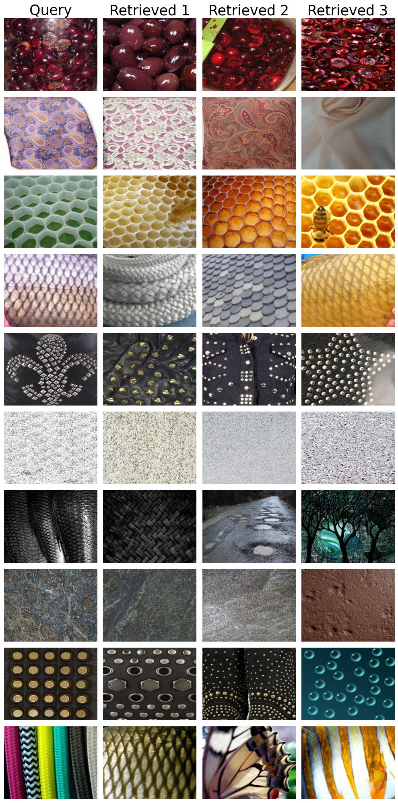
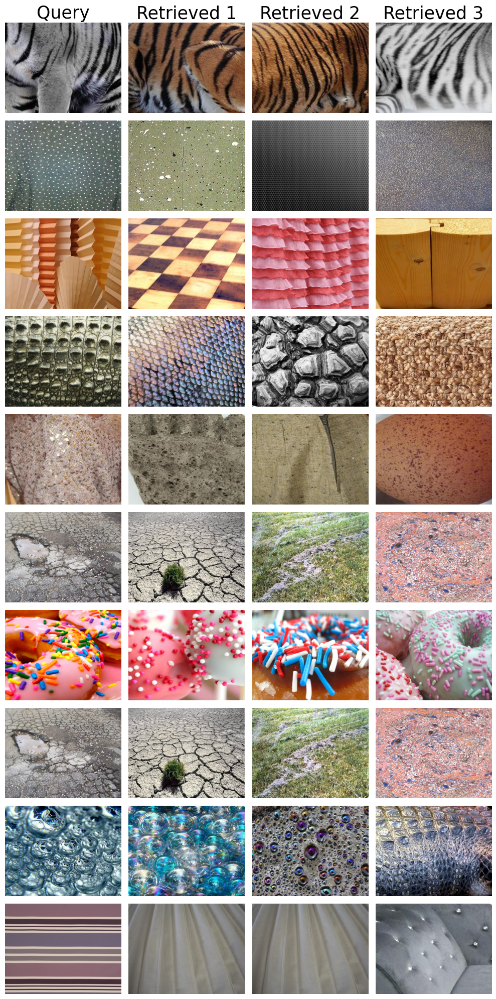

# Content-Based Image Retrieval Engine

This project implements a Content-Based Image Retrieval Engine, combining Color Histogram, GLCM (Gray Level Co-occurrence Matrix), Visual Bag of Words with SIFT (Scale-Invariant Feature Transform), and deep learning features. PCA (Principal Component Analysis) is employed to reduce feature dimensions for improved search speed.

## Introduction

The Multi-Feature Image Search System offers an efficient and versatile image retrieval solution by incorporating multiple feature extraction techniques. By combining Color Histogram, GLCM, SIFT with Visual Bag of Words and K-Means, as well as deep learning features, the system aims to provide accurate and fast image searches in a diverse dataset.

## Features

- **Color Histogram:** Captures the distribution of color intensities in images.
- **GLCM (Gray Level Co-occurrence Matrix):** Describes spatial relationships of pixel values in grayscale images.
- **SIFT with Visual Bag of Words and K-Means:** Utilizes SIFT features with a visual bag of words approach and K-Means clustering.
- **Deep Learning Features:** Extracted from a pretrained neural network, enhancing the system's capability.
- **PCA (Principal Component Analysis):** Dimensionality reduction technique to improve search speed.

## Visualization of System Performance

Here are some examples showcasing the top-ranked retrieval results for some query images.

